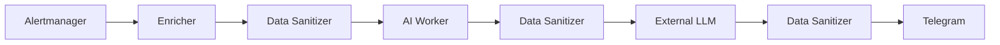

# IncidentGPT Data Sanitizer: Architecture and Data Protection Model

## 1. Purpose

IncidentGPT Data Sanitizer is a dedicated protection gateway that prevents secrets, credentials, personal data, and other sensitive information from being sent to external LLM providers, Telegram, and other integrations. It is an independent network boundary between trusted IncidentGPT components and less trusted destinations.

## 2. Protected Assets

The service protects passwords, API keys, access and refresh tokens, JWTs, session identifiers, cookies, connection strings, private keys, Kubernetes Secret contents, email addresses, phone numbers, infrastructure resource names when pseudonymization is enabled, and IP addresses when policy requires masking.

## 3. Trust Boundaries

Alertmanager, Prometheus, and the Kubernetes API are treated as part of the trusted Kubernetes zone. External LLMs, Telegram, and outbound webhooks are external or less trusted zones. Sanitizer is placed on this boundary and is called multiple times during the incident workflow.



## 4. Processing Flow

For each request, Sanitizer authenticates the caller with HMAC, checks size and format limits, selects a destination policy, recursively traverses JSON, detects sensitive keys, applies text rules, redacts or pseudonymizes data, validates the safe result, writes an audit event without payload values, and returns only sanitized content.

## 5. Masking Model

Redaction replaces the full value, for example `[REDACTED_TOKEN]`. Masking hides part of a value, such as an email address or phone number. Pseudonymization replaces infrastructure identifiers with stable technical aliases. Blocking rejects processing when configuration, policy, size, depth, or parsing rules cannot be satisfied.

## 6. Pseudonymization

Resource names can be pseudonymized with `HMAC-SHA256(hashKey, resourceType + ":" + originalValue)`. A plain SHA256 hash is not used because infrastructure names are often guessable. The HMAC key is stored in a Kubernetes Secret. Rotating the key changes aliases, so cross-event correlation is stable only within one key generation.

## 7. Fail-Closed Behavior

Production deployments should keep `SANITIZER_FAIL_CLOSED=true`. If Sanitizer is unavailable, rejects a request, cannot parse JSON, or detects a limit violation, the original payload is not used for the LLM or Telegram. A minimal fallback alert may contain only alert name, severity, status, timestamp, and incident ID, with no annotations or enrichment.

## 8. Authentication and Authorization

Clients sign requests with HMAC-SHA256 over timestamp, request ID, method, path, and SHA256(body). Sanitizer validates clock skew and rejects reused request IDs through a TTL cache. Kubernetes NetworkPolicy limits inbound traffic to Enricher and AI Worker pods in the namespace. The service must not be exposed through public Ingress, NodePort, or LoadBalancer.

## 9. Logging and Audit

Allowed fields include request ID, source, destination, decision, redaction count, rule names, duration, and error code. Payloads, matched values, secrets, prompts, full LLM responses, Kubernetes Secret data, and personal data must not be logged.

```json
{
  "timestamp": "2026-08-05T10:00:00Z",
  "request_id": "01JXYZ123",
  "client": "ai-worker",
  "destination": "llm",
  "decision": "allow_after_sanitization",
  "redaction_count": 4,
  "rules": ["password", "jwt"],
  "policy_version": "v1"
}
```

## 10. Metrics and Monitoring

Monitor request volume, latency, redactions, failures, denied requests, authentication failures, input/output bytes, pod restarts, and ready replicas. Alert on rising failure rates, authentication failures, policy denials, high latency, unexpected redaction spikes, and unavailable sanitizer replicas.

## 11. Threat Model

| Threat | Vector | Control | Residual Risk |
| --- | --- | --- | --- |
| API token disclosure | Token in annotation | Redaction | Unknown token format |
| Database password disclosure | Connection string | Credential masking | Non-standard string |
| Prompt injection | Instruction in alert text | Sanitization + system prompt | External model behavior |
| Sanitizer bypass | Direct LLM call | NetworkPolicy and shared client | Misconfiguration |
| Replay request | Reused signed request | Timestamp and request ID | In-memory cache across replicas |
| Log leakage | Debug logging | No full payload logging | Future code error |
| HMAC key compromise | Kubernetes Secret | RBAC and rotation | Admin-level access |
| Large payload DoS | Oversized JSON | Size and depth limits | High request volume |

## 12. Known Limitations

Regex-based detection cannot guarantee full secret coverage. Unknown formats may be missed and false positives are possible. Sanitizer is not an enterprise DLP platform and does not replace IAM, RBAC, NetworkPolicy, or model isolation. External LLMs remain untrusted. Kubernetes Secrets should not be intentionally sent to IncidentGPT. Self-hosted LLMs are preferred for highly sensitive environments.

## 13. Production Recommendations

Use at least two replicas, PodDisruptionBudget, fail-closed mode, NetworkPolicy, HMAC or mTLS, secret rotation, image signing, vulnerability scanning, SBOM generation, read-only root filesystem, non-root runtime, minimal ServiceAccount permissions, no public Ingress, regular custom regexp review, and CI leak tests.

## 14. Information Security Review Checklist

- [ ] Sanitizer is enabled
- [ ] Fail-closed mode is enabled
- [ ] LLM cannot be reached directly in bypass of the approved route
- [ ] Telegram receives only sanitized text
- [ ] Logs do not contain payloads
- [ ] HMAC key is stored in a Kubernetes Secret
- [ ] NetworkPolicy is configured
- [ ] Sanitizer alerts are enabled
- [ ] Known-secret leak tests passed
- [ ] Personal data processing policy is reviewed
- [ ] Key rotation owner is defined
