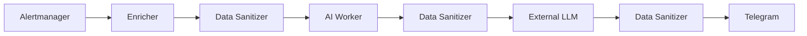

# Data Sanitizer IncidentGPT: архитектура и модель защиты данных

## 1. Назначение

Data Sanitizer предназначен для предотвращения передачи секретов, учётных данных, персональной и иной чувствительной информации во внешние LLM-сервисы, Telegram и другие интеграции IncidentGPT. Сервис является отдельной сетевой границей безопасности между внутренними компонентами IncidentGPT и внешними получателями.

## 2. Защищаемые активы

Sanitizer защищает пароли, API-ключи, access и refresh tokens, JWT, session identifiers, cookie, строки подключения, private keys, содержимое Kubernetes Secret, email, телефонные номера, внутренние имена инфраструктурных объектов при включённой псевдонимизации, а также IP-адреса при соответствующей политике.

## 3. Границы доверия

Alertmanager, Prometheus и Kubernetes API находятся внутри доверенной Kubernetes-зоны. Внешняя LLM, Telegram и внешние webhook рассматриваются как внешняя или менее доверенная зона. Sanitizer располагается на границе между ними и вызывается несколько раз в одном pipeline.



## 4. Поток обработки

Sanitizer получает payload, проверяет HMAC-подпись отправителя, ограничивает размер, выбирает policy по `destination`, рекурсивно анализирует JSON, ищет чувствительные ключи, применяет текстовые правила, маскирует или псевдонимизирует значения, повторно формирует безопасный ответ и пишет audit event без payload и секретов.

## 5. Модель маскирования

Redaction полностью заменяет значение, например `[REDACTED_TOKEN]`. Masking скрывает часть значения, например email или телефон. Pseudonymization стабильно заменяет инфраструктурный идентификатор на технический псевдоним. Blocking запрещает передачу payload при ошибке, неизвестном destination, превышении лимитов или неготовности конфигурации.

## 6. Псевдонимизация

Для имён namespace, pod, deployment, service, node, container и cluster может использоваться HMAC-SHA256: `HMAC-SHA256(hashKey, resourceType + ":" + originalValue)`. Обычный SHA256 не используется, потому что инфраструктурные имена часто угадываемы. Секретный ключ хранится в Kubernetes Secret. При ротации ключа псевдонимы изменятся, поэтому старые и новые события будут сопоставляться только в пределах одного ключа.

## 7. Fail-closed

Production-режим должен быть `SANITIZER_FAIL_CLOSED=true`. Если Sanitizer недоступен, вернул ошибку, получил неверный JSON или payload превысил лимиты, исходные данные не отправляются во внешний LLM или Telegram. Безопасный минимальный fallback может содержать только `alert_name`, `severity`, `status`, `timestamp` и `incident_id`, без annotations и enrichment.

## 8. Аутентификация и авторизация

Клиенты подписывают запросы HMAC-SHA256 с timestamp, request ID, HTTP method, path и SHA256 тела. Sanitizer проверяет допустимое отклонение времени и блокирует повторное использование request ID через TTL-cache. NetworkPolicy разрешает входящие запросы только от Enricher и AI Worker внутри namespace. Сервис не должен иметь публичный Ingress, NodePort или LoadBalancer.

## 9. Логирование и аудит

В логах и audit events допустимы request ID, source, destination, decision, redaction count, имена правил, длительность и error code. Запрещены payload, найденные значения, секреты, prompt, полный ответ LLM, Kubernetes Secret и персональные данные.

```json
{
  "timestamp": "2026-08-05T10:00:00Z",
  "request_id": "01JXYZ123",
  "client": "ai-worker",
  "destination": "llm",
  "decision": "allow_after_sanitization",
  "redaction_count": 4,
  "rules": ["password", "jwt"],
  "policy_version": "v1"
}
```

## 10. Метрики и мониторинг

Основные метрики: requests, duration, redactions, failures, denied, auth failures, input/output bytes. Рекомендуемые алерты: рост failures, рост authentication failures, рост denied requests, недоступность Sanitizer, увеличение latency, аномальный рост redaction count, перезапуски Pod и отсутствие ready replicas.

## 11. Threat model

| Угроза | Вектор | Защита | Остаточный риск |
| --- | --- | --- | --- |
| Утечка API-токена | Токен в annotation | Redaction | Неизвестный формат токена |
| Утечка пароля БД | Connection string | Маскирование credentials | Нестандартная строка |
| Prompt injection | Инструкция в alert text | Sanitization + system prompt | Поведение внешней модели |
| Обход Sanitizer | Прямой вызов LLM | NetworkPolicy и единый client | Ошибка конфигурации |
| Replay request | Повтор подписанного запроса | Timestamp и request ID | In-memory cache между репликами |
| Утечка через лог | Debug logging | Запрет полного payload | Ошибка нового кода |
| Компрометация HMAC key | Kubernetes Secret | RBAC и rotation | Доступ администратора |
| DoS большим payload | Большой JSON | Ограничение размера | Большое число запросов |

## 12. Ограничения

Regexp не гарантирует обнаружение всех секретов, неизвестные форматы могут быть пропущены, false positive возможны. Sanitizer не является корпоративной DLP-системой и не заменяет IAM, RBAC, NetworkPolicy или изоляцию LLM. Внешняя модель остаётся недоверенной. Kubernetes Secrets не следует специально передавать в IncidentGPT. Для особо чувствительных контуров предпочтительнее self-hosted LLM.

## 13. Рекомендации для production

Использовать минимум две реплики, PodDisruptionBudget, fail-closed, NetworkPolicy, HMAC или mTLS, регулярную ротацию secret, image signing, vulnerability scanning, SBOM, read-only filesystem, non-root runtime, ограниченный ServiceAccount, запрет публичного Ingress, регулярный review пользовательских regexp и тесты на утечки в CI.

## 14. Процедура проверки ИБ

- [ ] Sanitizer включён
- [ ] Fail-closed включён
- [ ] LLM недоступна напрямую из AI Worker в обход разрешённого маршрута
- [ ] Telegram получает только обработанный текст
- [ ] В логах нет payload
- [ ] HMAC-ключ находится в Kubernetes Secret
- [ ] Настроена NetworkPolicy
- [ ] Включены алерты Sanitizer
- [ ] Выполнены тесты на известные секреты
- [ ] Проверена политика обработки персональных данных
- [ ] Определён владелец процесса ротации ключей
